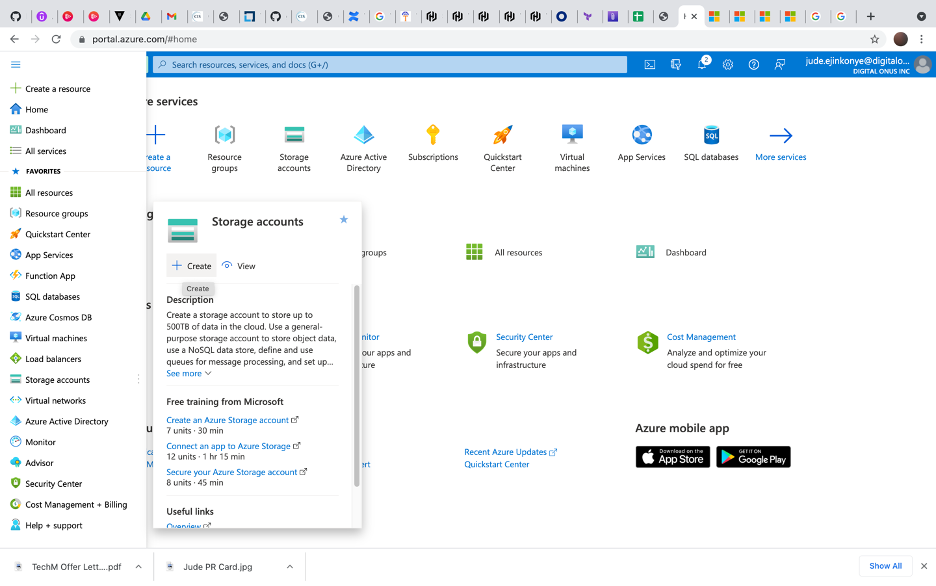
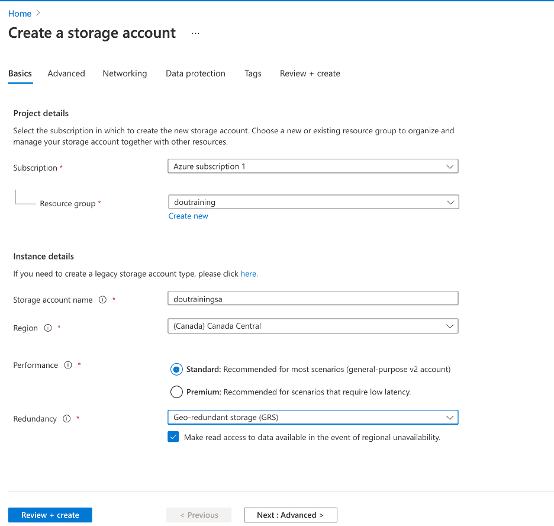
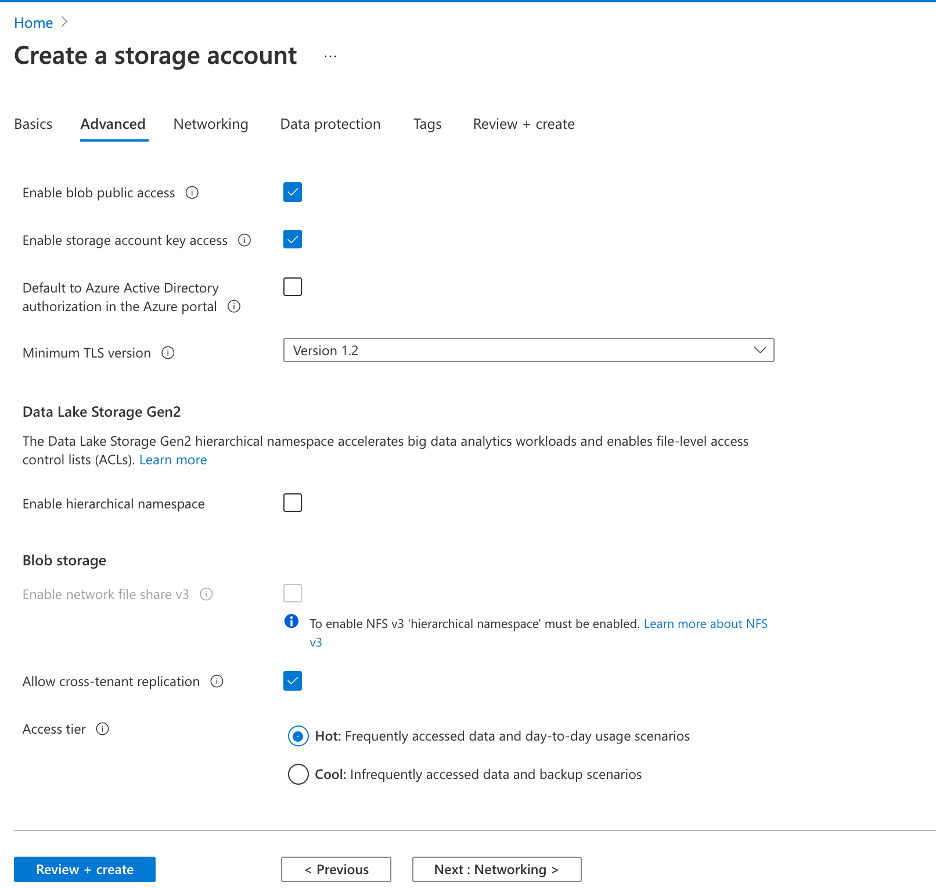
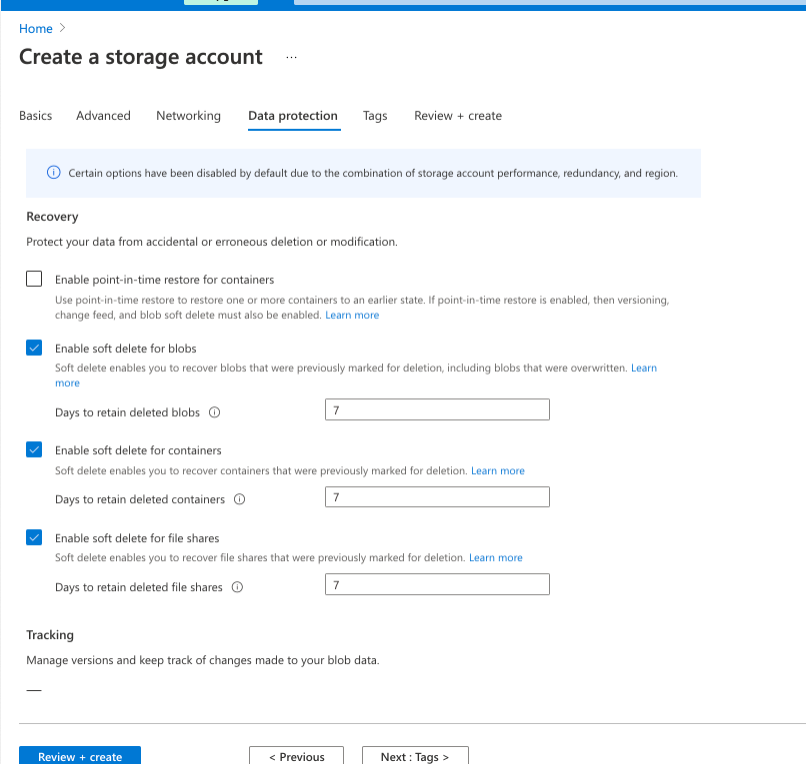
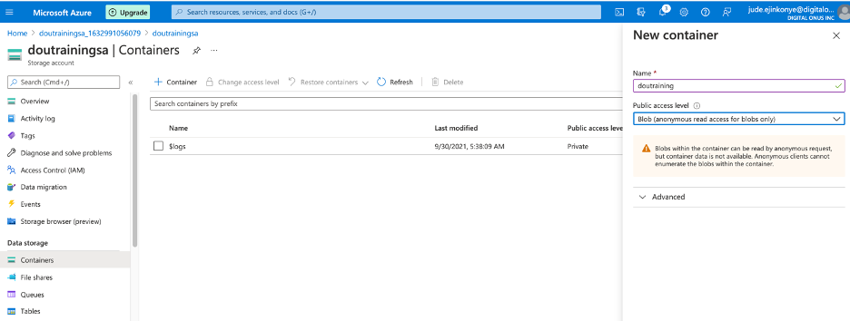

## Creating a Storage Account
Using the Resource Group previously created, in this task, a storage account will be created.

- **Step 1:** Ensure that you have switched back to the default AD, then from the Azure side panel select the **Storage Accounts**, and from the next panel, click on "Create"

- **Step 2:** Fill out the details under "Basic" tab as below. ensure to select the Resource Group that had already been created as well as the right subscription.

- **Step 3:** Under Advanced tab, select options as below. The public access is required to allow access to the blob stoarge with restriction (for testing purpose)

- **Step 4:** For the "Networking" tab, select options as below

- **Step 5:** For "Data Protection" tab, select options as below. **Soft Delete** will be tested on a seperate exercise

- **Step 6:** Proceed to create storage account. Allow a few minutes to complete deployment. Return to the Storage Account home page and select the storage account you have created. this would display the storage types under the account

Notice that in Blob Storage, a container is created for storing the files (blob). Click on Storage Browser to see more details. In a seperate activity, a sample file will be uploaded to a blob container.