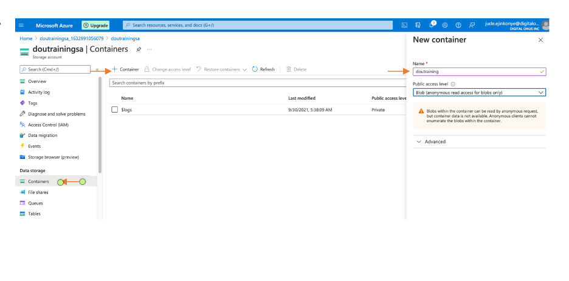
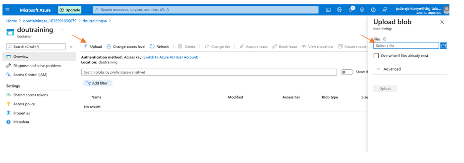
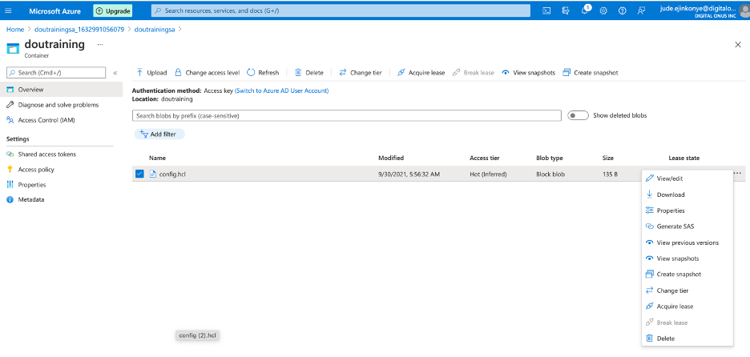
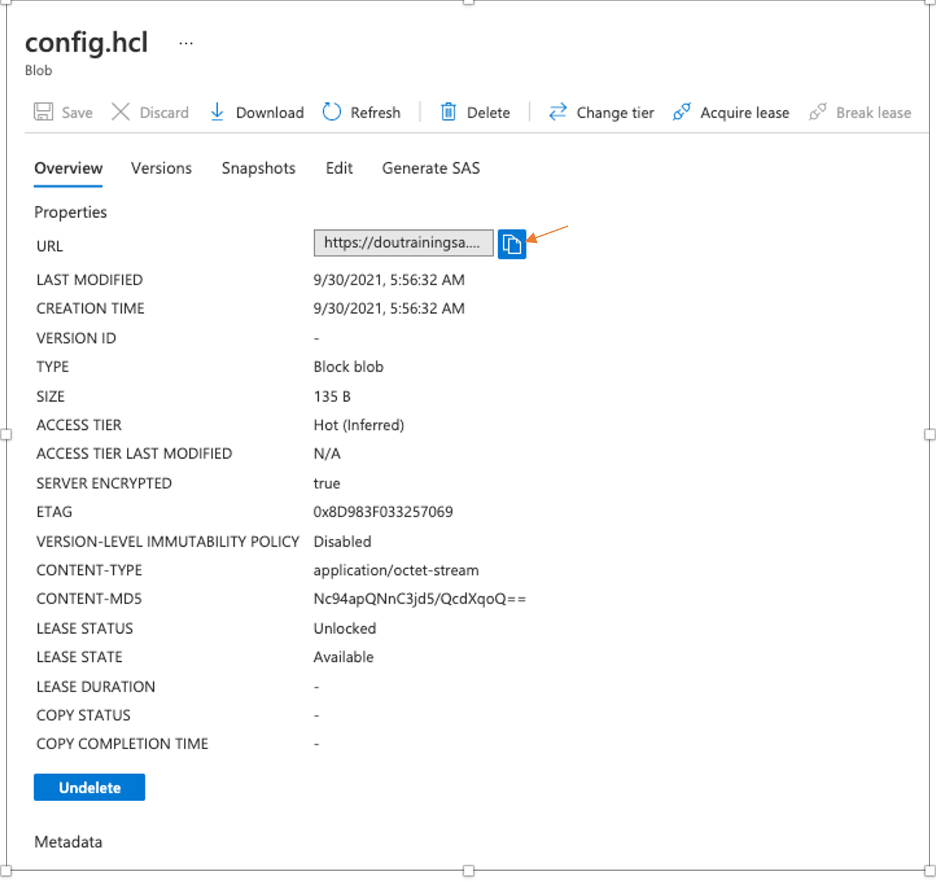

## Upload a file to Blob Container
Using the storage account previously created, you may notice a default container for logs already created. In this activity, a new container will be created and a sample file will be uploaded to the container.

- **Step 1:** Ensure you are on the default AD, navigate to the side panel and select "Storage account", then click on the storage account that was created in previous activity

- **Step 2:** From the side panel, under the "Data Storage" go to "Containers" then select "Container" tab and enter a name for the new container then proceed to create.

- **Step 3:** Select the new container, click on the "Upload" tab then browse to a sample file on you local system and upload to the blob container.

- **Step 4:** The sample file or object should be seen in the blob container. Click on the **"..."** to display options for the file and explore the properties. The file can be downloaded directly by select the "Download" option or using a URL. 

- **Step 5:** To download the sample file by URL, click on select "Properties" and copy the URL. Use a browser to access the URL, the image will automatically be downloaded.

