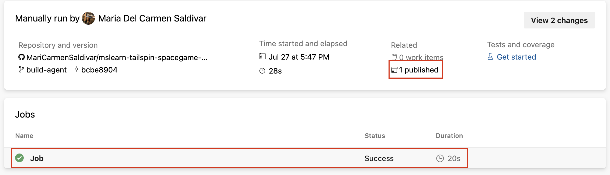
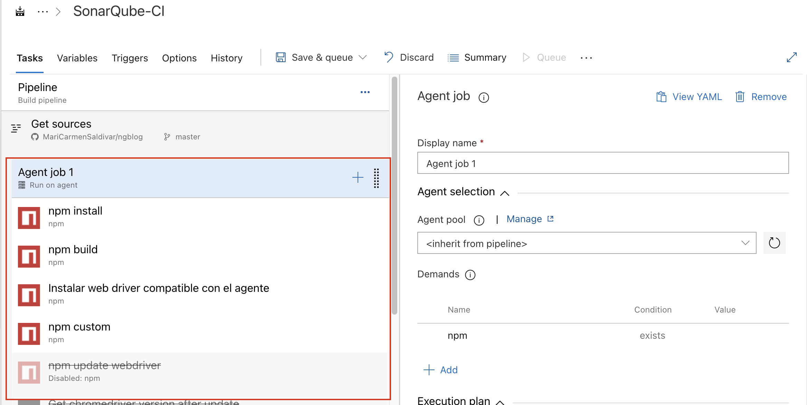
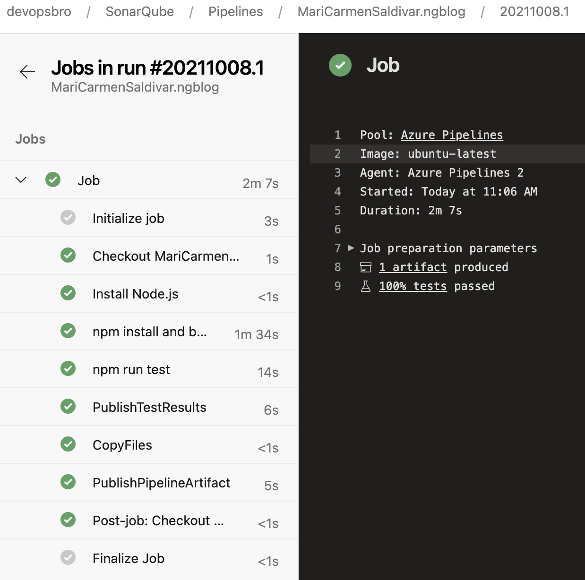

# Microsoft Azure
# 03 - Azure Pipelines.

### Instructions

**Activity 1**: Create a build YAML pipeline.

1. Get the sample application (fork): [SpaceGame](https://github.com/MicrosoftDocs/mslearn-tailspin-spacegame-web).
2. Clone your fork locally.
3. Build and run the web app locally. Some Help [build-locally](https://docs.microsoft.com/en-us/learn/modules/create-a-build-pipeline/3-build-locally).
4. Create the pipeline. Steps [Exercise - Create the pipeline](https://docs.microsoft.com/en-us/learn/modules/create-a-build-pipeline/6-create-the-pipeline).
5. Add tasks: Publish the result to the pipeline. [Steps](https://docs.microsoft.com/en-us/learn/modules/create-a-build-pipeline/7-publish-build-result).
6. Create Templates. Steps [Build multiple configurations by using templates](https://docs.microsoft.com/en-us/learn/modules/create-a-build-pipeline/8-build-multiple-configurations).
7. Configure a Schedule release trigger to run each week day (monday to friday) at 3 am just for main branch.

**Activity 2**: Create a build Classic Pipeline.

1. Follow the steps 1 to 5 from the Activity 1 in order to create a Classic Pipeline.
2. Enable continuous integration for all branches in your repo.
3. Configure a Schedule build trigger to run each week day (monday to friday) at 3 am just for main branch.

### Expected deliverables
# Deliverables

* Once you're done. Copy the code that you have in your repo for the YAML Pipeline and template, and include it as a deliverable.
* URL of your pipelines

Take screenshots of
* Your Github service connection created.
* A successful YAML and Classic pipeline run.

* The jobs list in the terminal log of the pipeline

* How configure Trigger.

# Evaluation
## Overall Evaluation

| Metric name        | % Value |
|:------------------ |:--:|
| Create a build YAML pipeline. |  50% |
| Create a build Classic Pipeline. |   50% |

## Break Down of the Evaluation per mind map

 Metric name        | Metric description                                | % Value |
|:------------------ |:--------------------------------------------------|:--:|
|  Activity 1 | Service Connection with Github.  | 5% |
|  Activity 1 | Create YAML pipeline and run success  | 35% |
|  Activity 1 | Add template files | 5% |
|  Activity 1 | Configure Schedule trigger | 5% |
|  Activity 2 | Create Classic Pipeline and run success  | 40% |
|  Activity 2 | Enable Continuous Integration  | 5% |
|  Activity 2 | Configure Schedule build | 5% |

## More references

[Create a build pipeline with Azure Pipelines](https://docs.microsoft.com/en-us/learn/modules/create-a-build-pipeline/)

[Azure Pipelines documentation](https://docs.microsoft.com/en-us/azure/devops/pipelines/?view=azure-devops)